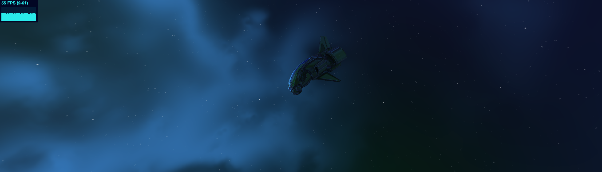
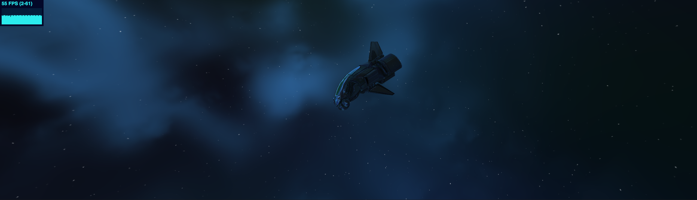
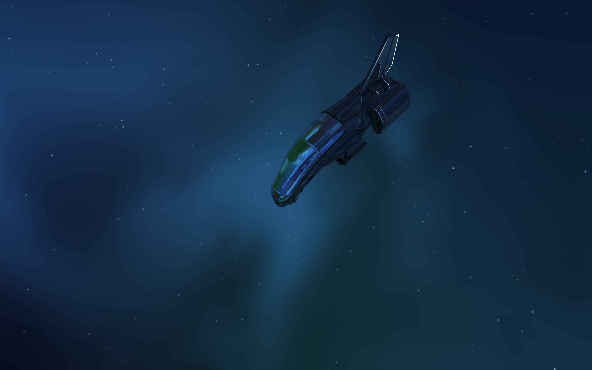

## SpaceFriction

[Link to test it](https://incursiores.ru/projects/SpaceFriction/)

WebGL 2.0 demo based on luma.gl framework  

#### Features:
- Absolutely free camera based on quaternions
- GPU Procedural generated space
- Space changing by moving
- Physical Based Rendering
- Image Based Lighting
- Simple shadowmap
- glTF models

#### Screenshots

